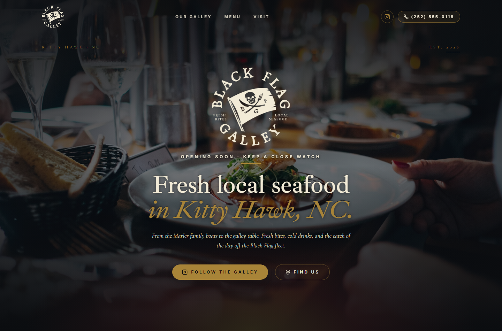

# Black Flag Galley

**Restaurant brand & marketing site — Next.js 15, built solo as a Stack & Signal concept.**

🔗 **Live demo:** https://hollywood017.github.io/black-flag-galley/

---

## What it is

A full brand and marketing site for a fresh-seafood eatery concept in Kitty Hawk, NC — from a custom circular emblem logo to an atmospheric hero, an "Our Galley" story panel, a menu section, and a "Visit / Find Us" flow. Warm, cinematic, and built to make a small restaurant feel like a destination.

Designed and built solo as a **Stack & Signal** project.

## What it shows

- **Brand + web together** — a hand-built logo emblem (light/dark variants) integrated into a cohesive visual identity.
- **Art direction** — moody photography, custom serif/display type, and a gold-on-ink palette that reads as premium hospitality.
- **Motion** — Framer Motion entrance and scroll animations across hero, story, and menu.
- **Componentized architecture** — typed React components (`Hero`, `Logo`, `StoryPanel`, menu sections) with content in a single constants module.
- **SEO & sharing** — semantic metadata and Open Graph handling wired in from the start.

## Stack

Next.js 15 (App Router) · TypeScript · Tailwind CSS · Framer Motion · lucide-react · static-exported for hosting.

## About this demo

This is a **portfolio demo**, not an official restaurant website. It's a Stack & Signal concept/spec build, published here only to showcase the work, and set to `noindex` so it won't be indexed or mistaken for a live business site.

**Nicholas Hoats** · nhoatz@gmail.com · [github.com/hollywood017](https://github.com/hollywood017) · [coastalops.io](https://coastalops.io)
